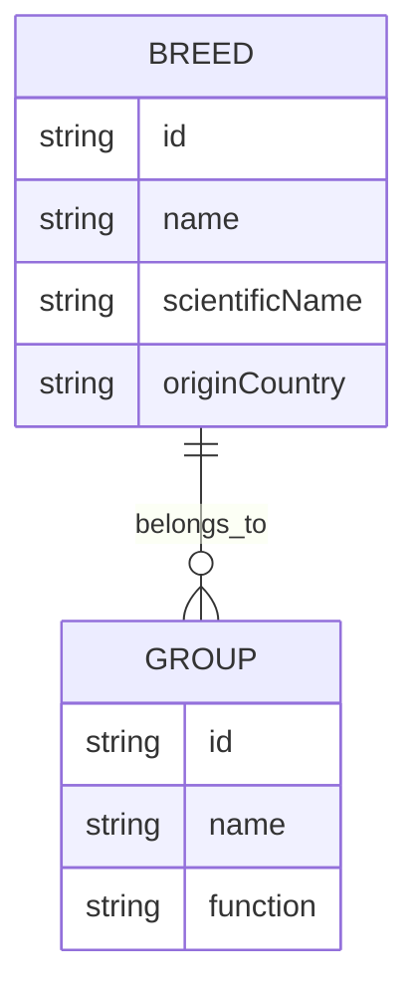

## 🐶 Atlas sémantique des races de chiens

### 🎯 Objectifs du projet

Ce projet vise à créer une plateforme web hypermédia permettant d’explorer les races de chiens à travers des données structurées, des métadonnées RDF et des visualisations interactives. Il s’appuie sur des sources publiques pour offrir une expérience éducative, accessible et enrichie par des relations sémantiques entre les races, leurs origines et leurs caractéristiques.

---

### 👥 Public cible
 
- Passionnés d’animaux et éducateurs

---

### 🧰 Technologies utilisées

#### Front-end
- HTML5, CSS3, JavaScript  
- Bootstrap  
- Interface web via Omeka S

#### Back-end
- PHP (Omeka S)  

#### Base de données
- MySQL

#### API & Services
- REST API (Omeka S)  

#### Données et multimédia
- JSON / XML  
- D3.js (visualisation)  
- Fichiers image des races

#### Outils & environnements
- Git / GitHub  
- WAMP (Windows)

---

### ⚙️ Fonctionnalités prévues

- Moteur de recherche par nom ou origine  
- Système de filtres (taille, tempérament, fonction)  
- Galerie multimédia avec images et descriptions  
- Exportation des données RDF ou CSV  

---

### 📊 Diagramme entité-relation (Mermaid)

